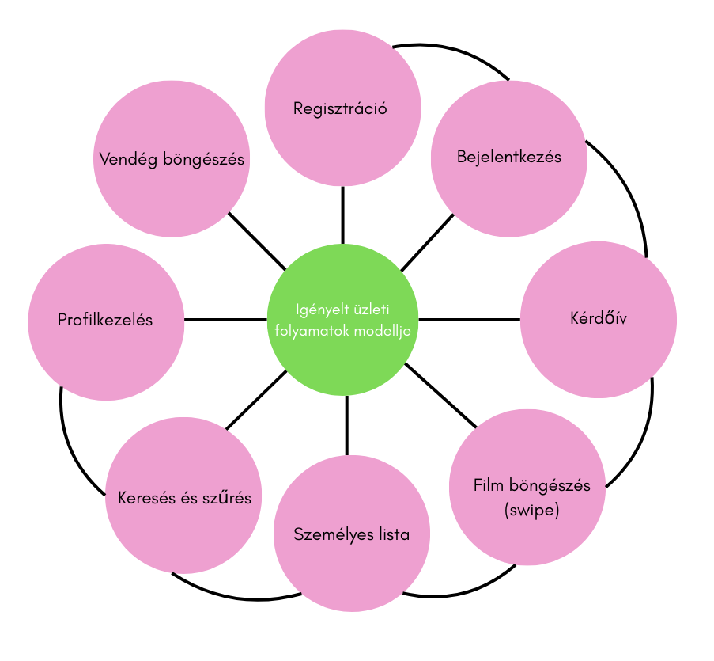

# Filmajánló

## 1. Áttekintés

Az alkalmazás célja, hogy a felhasználók naprakész információkat kapjanak a legújabb filmekről, értékelhessék azokat, és saját filmlistákat készíthessenek. A rendszer webes felületen keresztül érhető el, amely reszponzív kialakításának köszönhetően mobiltelefonon, tableten és asztali számítógépen is egyaránt használható.

A filmek adatai az IMDb API-VAL kerülnek a rendszerbe, így automatikusan frissülnek a legfrissebb információk (cím, műfaj, év, színészek, poszter, rövid leírás, értékelés). Az alkalmazás két felhasználói szerepkört támogat: regisztrált felhasználó és vendég.

A regisztrált felhasználók filmeket adhatnak saját listáikhoz, értékelhetnek és véleményezhetnek filmeket, míg a vendégek csak böngészhetik a filmadatokat. A rendszer célja, hogy egyszerűen üzemeltethető legyen, platformfüggetlen, és GDPR kompatibilis felhasználókezelést biztosítson.

---

## 2. Jelenlegi helyzet

Jelenleg a filmek felfedezése a felhasználók számára többnyire statikus weboldalakon vagy streaming szolgáltatások felületein történik, ahol hosszadalmas keresés vagy böngészés szükséges. A személyre szabott, interaktív élmény hiányzik: a felhasználók nem kapnak azonnali visszajelzést az ízlésüknek megfelelő filmekről, és nincs egyszerű, játékos mód a filmek felfedezésére.

A tervezett rendszerben a felhasználók regisztráció után egy kérdőívet töltenek ki, amely alapján az algoritmus körvonalazza a filmekkel kapcsolatos preferenciáikat (pl. kedvenc műfajok, hangulatok, stílusok, korábbi kedvencek). Ez az információ szolgál a személyre szabott ajánlások alapjául.

A filmek felfedezése egy Tinder-szerű swipe mechanizmussal történik: a felhasználó először a film borítóját, címét és a megjelenés évét látja. Interaktív felület lehetővé teszi, hogy a felhasználó gyorsan eldönthesse, hogy szeretné-e hozzáadni a filmet a személyes listájához, vagy tovább lépjen a következő ajánlásra.

---

## 3. Vágyálom rendszer

A projekt célja egy olyan webalkalmazás, amely gyors, játékos és személyre szabott filmfelfedezést biztosít a felhasználók számára. A rendszer reszponzív webes felületen érhető el, mobiltelefonon, tableten és asztali számítógépen egyaránt.

Regisztrációt követően a felhasználók egy rövid kérdőívet töltenek ki, amely alapján az algoritmus felméri az ízlésüket, kedvenc műfajaikat, hangulatpreferenciáikat és korábbi kedvenceiket. Ennek megfelelően a felhasználók **Tinder-szerű swipe mechanizmussal** böngészhetik a filmeket: először a film borítója, címe és megjelenési éve jelenik meg, majd lejjebb görgetve részletes összegzés, kritikai vélemények és értékelések érhetők el.

A rendszer lehetővé teszi, hogy a felhasználók kedvenc filmjeiket elmentsék saját listájukba, értékeljék és véleményezzék azokat. A személyre szabott algoritmus a felhasználói értékelések alapján folyamatosan finomítja az ajánlásokat, így a filmfelfedezés mindig az aktuális ízléshez igazodik.

A vendég felhasználók számára a rendszer betekintést nyújt a filmkínálatba, borító, cím és megjelenési év megjelenítésével, azonban számukra nem elérhető a kérdőív kitöltése, a személyes lista létrehozása vagy az értékelés lehetősége.

Az alkalmazás ideális esetben látványos, intuitív és szórakoztató felülettel rendelkezik, amely ösztönzi a felhasználókat a filmek felfedezésére. A rendszer automatikusan frissíti a filmadatokat az IMDb API segítségével, biztosítva a naprakész tartalmat. GDPR-kompatibilis, biztonságos felhasználókezelést biztosít, és könnyen üzemeltethető a fejlesztők számára is.

---

## 4. Funkcionális követelmények

A rendszer fő funkciói a felhasználói élményre és a filmfelfedezésre koncentrálnak, két szerepkörre bontva: regisztrált felhasználó és vendég (guest).

### Regisztrált felhasználó funkciói:

* **Regisztráció és bejelentkezés:** E-mail cím és jelszó megadása; a rendszer biztonságosan tárolja az adatokat.
* **Kérdőív kitöltése:** Preferenciák (műfaj, hangulat, kedvenc filmek, színészek) rögzítése, amely az algoritmus személyre szabott ajánlásait vezérli.
* **Swipe mechanizmus:** Filmek gyors lapozása, elsődleges adatok megtekintése (borító, cím, év), részletek görgetéssel.
* **Személyes lista:** Kedvenc filmek elmentése, későbbi böngészés, szűrés és rendezés lehetősége.
* **Értékelés és véleményezés:** Csillagokkal történő pontozás/rövid szöveges vélemény hozzáadása.

### Vendég (Guest) funkciói:

* **Film böngészés:** Borító, cím és megjelenési év megjelenítése a főoldalon.
* **Korlátozott hozzáférés:** A vendégek nem tölthetnek ki kérdőívet, nem hozhatnak létre listát, és nem értékelhetnek filmeket.

---

## 5. Rendszerre vonatkozó törvények, szabványok, ajánlások

A rendszer fejlesztése során a következő jogszabályokat és szabványokat kell figyelembe venni:

* **GDPR (General Data Protection Regulation):** A felhasználók személyes adatainak védelme kötelező, különösen a regisztráció során gyűjtött adatok és a kérdőívben megadott preferenciák esetén. A rendszernek biztosítania kell a felhasználók számára az adataikhoz való hozzáférést, azok módosítását és törlését.
* **Adatbiztonság:** A felhasználói jelszavakat titkosított formában kell tárolni (hash-elés, sózás), a kommunikáció HTTPS protokollon keresztül történik.
* **Webes szabványok:** A felület HTML5, CSS3 és JavaScript (ES6+) szabványok szerint készül, biztosítva a böngészőfüggetlenséget és a reszponzivitást.
* **Platformfüggetlenség:** A rendszer backend-je Node.js, MySQL adatbázis használatával, amely bármely modern szerveren futtatható.
* **Könnyen üzemeltethető architektúra:** A fejlesztés során a kód és az adatbázis struktúrája átlátható, dokumentált és skálázható legyen.

Ezek a szabályok és ajánlások biztosítják, hogy a webalkalmazás biztonságos, jogilag megfelelős és felhasználóbarát legyen, miközben modern webes technológiákat alkalmaz.

---

## 6. Jelenlegi üzleti folyamatok modellje

A mai világban a filmek felfedezése és kiválasztása a felhasználók számára nagyrészt hagyományos, statikus weboldalakon vagy streaming szolgáltatások felületein történik. A jelenlegi folyamat nem használja ki a modern technológiák és interaktív felületek lehetőségeit, így a filmek felfedezése gyakran hosszadalmas és kevésbé személyre szabott.

Jelenleg a felhasználók manuálisan keresnek filmeket műfaj, év vagy népszerűség alapján, böngésznek kritikákat és értékeléseket, majd jegyzetek vagy könyvjelzők segítségével tartják nyilván a kedvenceiket. Nincs lehetőség gyors, játékos interakcióra, az új filmek azonnali felfedezésére, vagy személyre szabott ajánlásokra. A felhasználók nem tudják könnyen nyomon követni az ízlésüknek megfelelő filmeket, és a felfedezés élménye sok esetben unalmas, időigényes.

Ezek a problémák motiválják a jelenlegi folyamat kibővítését, ahol a filmes swipe mechanizmus révén a felhasználók gyorsan és szórakoztató módon találhatják meg a számukra érdekes filmeket, miközben a rendszer folyamatosan tanul az értékeléseikből és a preferenciáikból.

---
## 7. Igényelt üzleti folyamatok

A jelenlegi filmkeresési és felfedezési folyamatot egy interaktív, személyre szabott filmes swipe mechanizmusra szeretnénk lecserélni, amely gyors, játékos és élvezetes módot biztosít a filmek felfedezésére.

A felhasználó a főoldalon regisztrálhat vagy vendégként böngészhet. A regisztráció során egy új oldalon kitölti a kérdőívet, amely tartalmazza a kedvenc műfajokat, hangulatpreferenciákat, kedvenc színészeket és filmeket. A rendszer az összegyűjtött adatok alapján személyre szabott ajánlásokat készít.

A regisztrált felhasználó bejelentkezést követően a filmeket Tinder-szerű swipe mechanizmussal böngészheti: először a film borítója, címe és megjelenési éve jelenik meg; lefelé görgetve a felhasználó részletes információt, összegzést, kritikákat és felhasználói véleményeket tekinthet meg. A felhasználó eldöntheti, hogy a filmet kedvencként elmenti a személyes listájába, vagy továbblapoz a következő ajánlásra.

A rendszer az értékelések és lapozások alapján folyamatosan finomítja az ajánlásokat, így a filmfelfedezés mindig az aktuális ízléshez igazodik. A vendégek számára a főoldalon elérhető a filmek borítója, címe és megjelenési éve, de nem érhetik el a személyre szabott swipe mechanizmust, kérdőívet, listakezelést vagy értékelést.

Az igényelt folyamat így biztosítja, hogy a felhasználók gyorsan, szórakoztató módon fedezhessék fel a számukra érdekes filmeket, miközben a rendszer folyamatosan alkalmazkodik az egyéni preferenciákhoz és javítja az ajánlások pontosságát.

---
## 8. Követelménylista

| Modul ID | Név / Kifejtés         | Funkciók / Al-funkciók                                                                                       |
|----------|------------------------|-------------------------------------------------------------------------------------------------------------|
| K1       | Bejelentkezési felület | A felhasználó az e-mail címe és jelszava segítségével bejelentkezhet. Hibás adatok esetén hibaüzenet jelenik meg. A vendégek guest módban is beléphetnek, korlátozott funkciókkal. |
| K2       | Regisztráció           | A felhasználó e-mail címe, jelszava és felhasználói neve megadásával regisztrálhat. A jelszó titkosított formában (hash) kerül tárolásra. Regisztráció után a felhasználó kitölti a személyre szabott kérdőívet. |
| K3       | Kérdőív                | A felhasználó megadja preferenciáit (műfaj, hangulat, kedvenc színészek, kedvenc filmek). Az adatok alapján az algoritmus személyre szabott filmajánlásokat készít. |
| K4       | Film böngészés (Swipe) | A filmek elsődleges adatai (borító, cím, év) megjelennek. Lejjebb görgetve részletes összegzés, kritikai vélemények és felhasználói értékelések láthatók. Jobbra húzás = kedvenc, balra húzás = továbblépés. |
| K5       | Személyes lista        | A regisztrált felhasználó elmentheti kedvenc filmjeit, szűrhet, rendezhet és később visszanézheti azokat. |
| K6       | Értékelés és véleményezés | A felhasználó csillagokkal pontozhatja a filmeket, valamint rövid véleményt írhat. Ezek az adatok finomítják az algoritmus ajánlásait. |
| K7       | Vendég böngészés       | A vendég csak a film borítóját, címét és évét láthatja. Nem érhető el számára a kérdőív, swipe mechanizmus, lista vagy értékelés.  |
| K8       | Filmadat frissítés     | A rendszer automatikusan frissíti az adatokat az IMDb API-ról vagy web scraping segítségével, biztosítva a naprakész információt. |
| K9      | Biztonság és GDPR      | A felhasználói adatok védelme, jelszó titkosítás, HTTPS kommunikáció, GDPR-kompatibilitás biztosítása. |

## 8.1. Rendszer áttekintés

*A fenti ábra szemlélteti a rendszer fő moduljait*

---

## 9. Riportok

A rendszer két típusú riportot támogat az adatok elemzésére és a felhasználói élmény javítására:

* **Szabad riport:** Ebben a riportban a kérdés az, hogy az új rendszer hogyan működne ideálisan. A riport lehetővé teszi a fejlesztők és tesztelők számára, hogy szövegesen leírják tapasztalataikat, és javaslatokat tegyenek a funkciók, a swipe mechanizmus, a kérdőív és az ajánlások működésének optimalizálására.
* **Irányított riport:** Rövid, előre meghatározott kérdésekből áll, amelyek célja, hogy gyorsan visszajelzést adjon a felhasználók interakcióiról. Például: „Mennyire találta hasznosnak a személyre szabott ajánlásokat?”, „Hogyan értékeli a swipe mechanizmus kényelmét?”, „Mennyire elégedett a filmadatok részletességével?”. Az irányított riport segít az adatok strukturált összegzésében és a rendszer finomhangolásában.

---

## 10. Fogalomtár

| Fogalom                       | Meghatározás                                                                                                                             |
| ----------------------------- | ---------------------------------------------------------------------------------------------------------------------------------------- |
| **Reszponzív felület**        | A webalkalmazás mobilon, tableten és PC-n egyaránt megfelelően jelenik meg, a képernyőmérethez igazodva.                                 |
| **Swipe mechanizmus**         | A felhasználó jobbra vagy balra húzza a film borítóját, hogy eldöntse, kedvencként elmenti-e vagy továbblép.                             |
| **Kérdőív**                   | Regisztráció után kitöltött rövid felmérés a felhasználó filmpreferenciáiról, amely az ajánló algoritmus alapját képezi.                 |
| **Személyre szabott ajánlás** | A rendszer az adott felhasználó preferenciái és értékelései alapján generált filmek listája.                                             |
| **IMDb API**                  | Külső adatforrás, amely a filmek adatait (borító, cím, év, értékelés) biztosítja a webalkalmazás számára.                                |
| **Vendég (Guest)**            | A felhasználói szerepkör, amely korlátozott hozzáférést biztosít: filmek böngészhetők, de nincs swipe, kérdőív vagy értékelés lehetőség. |
| **GDPR**                      | Általános adatvédelmi rendelet, amely előírja a személyes adatok biztonságos kezelését és a felhasználók jogait az adataik felett.       |
| **Értékelés és véleményezés** | A regisztrált felhasználók által adott csillagok és rövid szöveges vélemények a filmekhez, amelyek finomítják az ajánlásokat.            |

---

