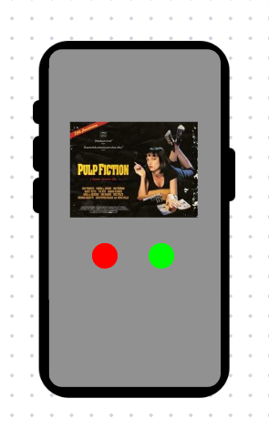
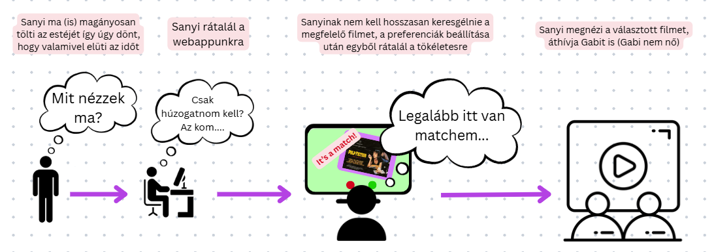

# Rendszerterv

## 1. A rendszer célja

A rendszer célja, hogy a felhasználók számára egy modern, interaktív filmajánló platformot biztosítson, amely swipe funkcionalitással működik. A felhasználók játékos módon fedezhetnek fel új filmeket úgy, hogy jobbra húzzák (like) a tetszőket, balra pedig azokat, amelyek nem érdeklik őket (dislike). A rendszer a TMDB (The Movie Database) API-t használva gazdag filmes tartalmat biztosít, beleértve a filmek részletes adatait, posztereket, értékeléseket és műfajokat.

A platform fő funkciói között szerepel a személyre szabott filmajánlás, amely a felhasználói preferenciák alapján működik - a rendszer jegyzi, hogy milyen műfajokat, éveket vagy értékelésű filmeket kedvel a felhasználó. A kedvelt filmek automatikusan bekerülnek a felhasználó watchlist-jébe, ahol nyomon követheti, hogy mely filmeket szeretné megnézni, és melyeket tekintette már meg.

A rendszer minimalistikus, felhasználóbarát interfészt kínál, amely könnyen navigálható és modern design elemeket tartalmaz. A felhasználók regisztrálhatnak, személyes profilt hozhatnak létre, beállíthatják preferenciáikat (kedvelt műfajok, korszakok, értékelési küszöbök), valamint követhetik filmfogyasztási szokásaikat.

A rendszer kizárólag webes platformra készül, Vue.js frontend és Node.js backend technológiák használatával. Az alkalmazás reszponzív design-nal rendelkezik, így asztali és mobil eszközökön egyaránt használható. Mobil eszközökön a platform webview-n keresztül is elérhető, így lehetővé teszi a mobilalkalmazás-szerű felhasználói élményt anélkül, hogy natív alkalmazást kellene fejleszteni. Nem célunk más platformokra (iOS/Android natív alkalmazások) történő portolás.

A backend REST API-t biztosít az adatok kezeléséhez, amely MySQL adatbázissal kommunikál Sequelize ORM használatával. A rendszer biztonságos felhasználói hitelesítést valósít meg JWT tokenekkel, valamint biztosítja az adatok integritását és a felhasználói adatvédelmet.

## 2. Projektterv

### Projektszerepkörök, felelőségek:

**Scrum master:** valaki 
**Product owner:** valaki  

**Projektmunkások és felelőségek:**

**Frontend fejlesztés:** valaki

Feladatai: Vue.js alapú felhasználói felület kialakítása, reszponzív design implementálása, swipe funkcionalitás megvalósítása, komponens architektúra tervezése és megvalósítása.

**Backend fejlesztés:** Czakó Orsolya  

Feladatai: Node.js szerver architektúra kialakítása, REST API végpontok implementálása, adatbázis kapcsolat kezelése, hitelesítési rendszer megvalósítása, TMDB API integráció, SMTP szerver.

**Adatbázis tervezés:** Kreith Zsolt

Feladatai: MySQL adatbázis séma tervezése, Sequelize modellek létrehozása, foreign key kapcsolatok definiálása, adatbázis optimalizáció és indexelés.

**Rendszerintegráció:** Iklódi Nóra

Feladatai: Frontend-backend kommunikáció biztosítása, külső API-k integrálása, tesztelés és hibakeresés, deployment és konfigurációs feladatok.

### Ütemterv:

| Funkció / Story | Feladat / Task | Prioritás | Becslés (óra) | Aktuális becslés (óra) | Eltelt idő (óra) | Hátralévő idő (óra) |
|---|---|---|---|---|---|---|
| **Követelmény specifikáció** | Rendszer céljainak meghatározása | 0 | 8 | 8 | 8 | 0 |
| **Funkcionális specifikáció** | Use case-ek és funkciók leírása | 0 | 10 | 10 | 10 | 0 |
| **Rendszerterv** | Architektúra és adatbázis terv | 0 | 12 | 12 | 8 | 4 |
| **Adattárolás** | Adatmodell megtervezése | 0 | 6 | 6 | 6 | 0 |
| | Adatbázis megvalósítása | 1 | 4 | 4 | 4 | 0 |
| | Sequelize modellek létrehozása | 1 | 8 | 8 | 8 | 0 |
| **Autentikáció** | JWT token rendszer | 1 | 6 | 6 | 4 | 2 |
| | Regisztráció/bejelentkezés API | 1 | 4 | 4 | 4 | 0 |
| **TMDB API integráció** | Film adatok lekérése | 1 | 8 | 8 | 6 | 2 |
| | Film automatikus létrehozás | 2 | 4 | 4 | 4 | 0 |
| **Frontend alapok** | Vue.js projekt setup | 1 | 3 | 3 | 3 | 0 |
| | Router és komponens struktúra | 1 | 6 | 6 | 6 | 0 |
| | Design rendszer kialakítása | 2 | 8 | 8 | 4 | 4 |
| **Swipe funkcionalitás** | Kártyás film böngészés | 2 | 12 | 12 | 8 | 4 |
| | Like/dislike kezelés | 2 | 6 | 6 | 6 | 0 |
| **Felhasználói felületek** | Bejelentkezés/regisztráció | 2 | 8 | 8 | 6 | 2 |
| | Dashboard és navigáció | 2 | 6 | 6 | 4 | 2 |
| | Kedvencek listája | 2 | 4 | 4 | 2 | 2 |
| | Profil és beállítások | 3 | 6 | 6 | 0 | 6 |
| **Preferencia rendszer** | Műfaj beállítások | 3 | 8 | 8 | 0 | 8 |
| | Szűrési lehetőségek | 3 | 6 | 6 | 0 | 6 |
| **Tesztelés és optimalizáció** | Unit tesztek | 3 | 8 | 8 | 0 | 8 |
| | Performance optimalizáció | 3 | 4 | 4 | 0 | 4 |
| **Dokumentáció** | API dokumentáció | 3 | 4 | 4 | 2 | 2 |
| | Felhasználói útmutató | 3 | 3 | 3 | 0 | 3 |

**Prioritás:** 0 = Kritikus, 1 = Magas, 2 = Közepes, 3 = Alacsony

## 3. Üzleti folyamatok bemutatása

## 4. Követelmények

**Funkcionális követelmények:**
- Felhasználói regisztráció és hitelesítés
- Filmek böngészése swipe funkcionalitással
- Kedvenc filmek kezelése (like/dislike)
- TMDB API integráció film adatok lekérésére
- Személyre szabott filmajánlások
- Felhasználói preferenciák beállítása
- Reszponzív webes felület

**Nem funkcionális követelmények:**
- Biztonságos adatkezelés JWT tokenekkel
- Gyors válaszidő (max 2 másodperc)
- Cross-platform kompatibilitás (desktop, mobile web)
- Felhasználóbarát, intuitív felület
- Stabil működés nagy adatmennyiség mellett

**Törvényi előírások, szabványok:**
- GDPR megfelelés a személyes adatok kezelésében
- Adatvédelmi tájékoztató biztosítása
- Cookie kezelés és hozzájárulás

## 5. Funkcionális terv

**Rendszerszereplők:**
- Felhasználó (regisztrált)
- Vendég (nem regisztrált)

**Rendszerhasználati esetek és lefutásaik:**

**FELHASZNÁLÓ:**
- Regisztráció és bejelentkezés
- Filmek böngészése swipe funkcionalitással
- Filmek értékelése (like/dislike)
- Kedvenc filmek megtekintése és kezelése
- Személyes preferenciák beállítása (műfajok, évek, értékelések)
- Profil adatok módosítása
- Watchlist kezelése
- Film részletes adatainak megtekintése

**VENDÉG:**
- Regisztráció lehetősége
- Limitált film böngészés (preferenciák nélkül)
- Bejelentkezési felület elérése

**Menü-hierarchiák:**

**BEJELENTKEZÉS ELŐTT:**
- Bejelentkezés
- Regisztráció
- Vendég böngészés

**FŐMENÜ (bejelentkezés után):**
- Dashboard
- Filmek böngészése
- Kedvenc filmek
- Beállítások
  - Preferenciák
  - Profil szerkesztése
  - Téma váltás
  - Nyelv váltás
- Kijelentkezés

## 8. Architekturális terv

**Backend:**
A rendszerhez szükség van egy adatbázis szerverre, ebben az esetben MySQL-t használunk. A kliens oldali programokat egy Node.js alapú REST API szolgálja ki, ez csatlakozik az adatbázis szerverhez Sequelize ORM segítségével. A kliensekkel JSON objektumokkal kommunikál. A backend Express.js keretrendszert használ a HTTP kérések kezelésére és strukturált API végpontokat biztosít. A TMDB külső API integráció biztosítja a filmadatok automatikus betöltését.

**Web Kliens:**
A web alkalmazás Vue.js 3 keretrendszer használatával készül el, modern komponens alapú architektúrával. A REST API-hoz a felhasználó belépését követően JWT token segítségével lehet hozzáférni, ez biztosítja, hogy illetéktelen felhasználók ne módosíthassák az adatokat. A frontend reszponzív design-nal rendelkezik és Vite build eszközt használ a fejlesztéshez és telepítéshez.

**Adatbázis:**
MySQL relációs adatbázis motor biztosítja az adatok perzisztens tárolását. Az adatbázis tartalmazza a felhasználói adatokat, film információkat, értékeléseket és preferenciákat. Foreign key kapcsolatok biztosítják az adatintegritást a táblák között.

**Adatbázis kapcsolatok:**
- `account` 1:N `preferences` (egy felhasználónak több preferenciája lehet)
- `account` 1:N `interactions` (egy felhasználó több filmmel interaktálhat)
- `account` 1:N `watchlist` (egy felhasználónak több film lehet a watchlist-jében)
- `movies` 1:N `interactions` (egy filmmel több felhasználó interaktálhat)
- `movies` 1:N `watchlist` (egy film több felhasználó watchlist-jében lehet)
- `account` 1:1 `settings` (egy felhasználónak egy beállítás rekordja van)

## 10. Implementációs terv

**Web:**
A webes felület főként Vue.js 3, HTML, CSS és JavaScript nyelven készül. Ezeket a technológiákat komponens alapú architektúrával és külön fájlokba írva készítjük a jobb átláthatóság, könnyebb változtathatóság és bővítés érdekében. A rendszer követi a DRY és KISS elveket, minimalizálva a kódismétléseket és egyszerű, érthető megoldásokat alkalmazva.

A Vue.js komponensek felhasználják a backend részen futó REST szolgáltatás metódusait, ezáltal képesek adatokat felvinni és lekérdezni az adatbázisból. A kliens oldali állapotkezelés reactív módon kezeli a felhasználói interakciókat és az API válaszokat.

**Backend:**
A backend Node.js és Express.js technológiákkal készül, RESTful API elveket követve. Sequelize ORM biztosítja az adatbázis kommunikációt típusbiztos módon. A JWT token alapú hitelesítés biztosítja a biztonságos API hozzáférést.

**Adatbázis:**
MySQL relációs adatbázis a normalizált adatszerkezettel, foreign key kapcsolatokkal az adatintegritás biztosítására. Az indexelés optimalizálja a lekérdezési teljesítményt.

**Külső integráció:**
TMDB API integráció biztosítja a filmadatok automatikus szinkronizálását és frissítését.

## 11. Tesztterv

**Unit tesztek:**
- Backend API végpontok tesztelése
- Adatbázis modellek és kapcsolatok validálása
- Felhasználói hitelesítés és jogosultságkezelés

**Integrációs tesztek:**
- Frontend-backend kommunikáció
- TMDB API integráció működése
- Adatbázis kapcsolatok és foreign key megszorítások

**Funkcionális tesztek:**
- Felhasználói regisztráció és bejelentkezés
- Swipe funkcionalitás (like/dislike)
- Kedvencek kezelése és megjelenítése
- Preferenciák beállítása és alkalmazása

**Teljesítmény tesztek:**
- API válaszidők mérése
- Nagy adatmennyiség kezelése
- Konkurens felhasználói terhelés

**Böngésző kompatibilitás:**
- Chrome, Firefox, Safari, Edge tesztelés
- Mobil böngészők reszponzív megjelenítés
- Különböző képernyőméretek tesztelése

## 12. Telepítési terv

**Webes alkalmazás:**
- A szoftver webes felületéhez csak egy ajánlott böngésző telepítése szükséges (Google Chrome, Firefox, Safari, Edge)
- Külön szoftver telepítése nem szükséges
- A webszerverre közvetlenül az internetről kapcsolódnak rá a kliensek
- Minimum követelmények: modern böngésző JavaScript támogatással

**Szerver oldali telepítés:**
- Node.js runtime environment telepítése
- MySQL adatbázis szerver beállítása
- NPM függőségek telepítése
- Környezeti változók konfigurálása (TMDB API kulcs, adatbázis kapcsolat)
- Backend szerver indítása

## 13. Karbantartási terv

**Folyamatos üzemeltetés:**
Az alkalmazás folyamatos üzemeltetése és karbantartása, mely magában foglalja a programhibák elhárítását, a felhasználói igények változása miatti módosításokat, valamint a technológiai környezet fejlődése miatt megfogalmazott program módosítási igényeket.

**Karbantartási típusok:**
- **Corrective Maintenance:** Felhasználók által felfedezett hibák kijavítása
- **Adaptive Maintenance:** Új böngésző verziókkal való kompatibilitás biztosítása, TMDB API változások követése
- **Perfective Maintenance:** Új funkciók hozzáadása, teljesítmény optimalizáció, felhasználói élmény javítása

**Rendszeres feladatok:**
- Adatbázis mentések és optimalizáció
- Biztonsági frissítések alkalmazása
- Új filmadatok szinkronizálása
- Felhasználói visszajelzések alapján fejlesztések

